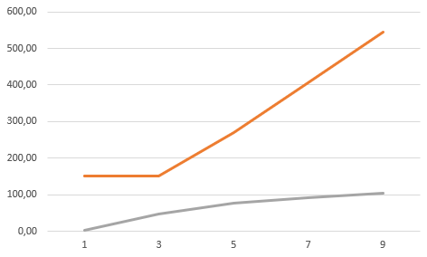
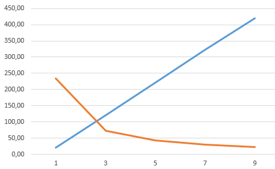
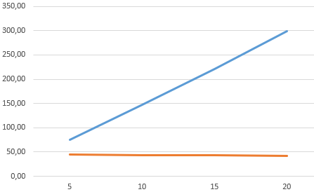
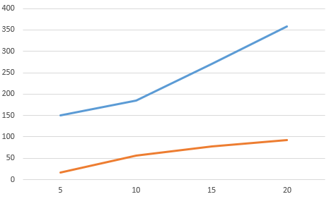
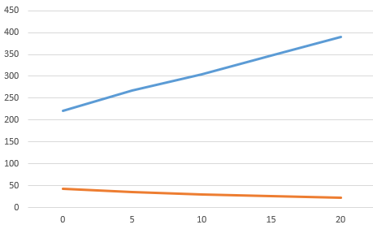
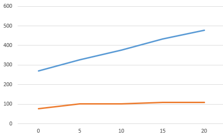

## Комп'ютерні системи імітаційного моделювання
## СПм-24-4, **Чертанов Ярослав Валерійович**
### Лабораторна робота №**1**. Опис імітаційних моделей та проведення обчислювальних експериментів

 

### Варіант 6, модель у середовищі NetLogo:
[Rabbits Grass Weeds](https://www.netlogoweb.org/launch#http://www.netlogoweb.org/assets/modelslib/Sample%20Models/Biology/Rabbits%20Grass%20Weeds.nlogo)

 

### Вербальний опис моделі:
Модель "заячого лугу" - це спрощенна біологічна модель, яка є формою класичних взаємин "хижак-жертва". Кожен заяць моделюєтсья агентом з таким набором правил: переміщується по картів симуляції, поглинає траву або бур'ян і розмножується при достатній енергії або вмирати при недостатній. Трава та бур'ян є пасивним середовищем, які з'являються через певний. Модель показує, як кількість хижаків і жертв взаємно коливається в часі.

### Керуючі параметри:
- **number** визначає кількість агентів-зайців у середовищі моделювання.
- **birth-threshold** визначає кількість енергії, за якої агент-заяць розмножується.
- **grass-grow-rate** визначає кількість тактів, через проходження яких з'являється нова трава.
- **grass-energy** визачає кількість енергії, які отримує агент-заяць при поглинанні трави.
- **weeds-grow-rate** визначає кількість тактів, через проходження яких з'являється новий бурьян.
- **weed-energy** визачає кількість енергії, які отримує агент-заяць при поглинанні бур'яна.

### Внутрішні параметри:
- **energy** Енергія агенту-зайця. Відрізняєтсья для кожного агенту-зайця в різні моменти модельного часу. 

### Показники роботи системи:
- кількість агентів-зайців на поточному такті симуляції.
- кількість трави на поточному такті симуляції.
- кількість бур'яну на поточному такті симуляції.

### Примітки:
При налаштуваннях керуючих параметрів за замовчуванням, бур'ян не з'являється зовсім.

### Недоліки моделі:
Переміщення зайців виконується випадково, а не до наближчої/найкращої їжі. Час існування особин необмежено часом, лише енрегією. Відсутність зміни росту трави/бур'яну, вони з'являються необмежено, гальмуючись лише часом до появи. 

 

## Обчислювальні експерименти

### 1. Вплив енергії трави на кількість популяції
Досліджується залежність середньої кількості агентів-зайців та трави і максимальну/мінімальну кількість агентів протягом певної кількості тактів (500), від кількості енергії , яку дає трава, зазначеній на початку симуляції.
Експерименти проводяться при енергії 1-9, з кроком 2, усього 5 симуляцій.  
Інші керуючі параметри мають значення за замовчуванням:
- **number**: 150
- **birth-threshold**: 15
- **grass-grow-rate**: 15
- **weeds-grow-rate**: 0
- **weed-energy**: 0

<table>
<thead>
<tr><th>Енергія трави</th><th>Середня кількість зайців</th><th>Середня кількість трави</th><th>Максимальна кількість зайців</th><th>Мінімальна кількість зайців</th></tr>
</thead>
<tbody>
<tr><td>1</td><td>21</td><td>233.3</td><td>150</td><td>2</td></tr>
<tr><td>3</td><td>119.9</td><td>72.6</td><td>150</td><td>46</td></tr>
<tr><td>5</td><td>221.3</td><td>43.2</td><td>271</td><td>77</td></tr>
<tr><td>7</td><td>323.8</td><td>30.4</td><td>406</td><td>92</td></tr>
<tr><td>9</td><td>419.4</td><td>22.8</td><td>545</td><td>104</td></tr>
</tbody>
</table>

Графік наочно показує, що утримання низької енергії трави може привести майже до вимирання зайців і навпаки, при великій енергії кількість трави значно зменшується.

Графік наочно показує, що за низької енергії трави популяція зайців не може перевищити початкове значення.

### 2. Вплив росту трави на кількість популяції
Досліджується залежність середньої кількості агентів-зайців та трави і максимальну/мінімальну кількість агентів протягом певної кількості тактів (500), від часу появи трави, зазначеного на початку симуляції.
Експерименти проводяться при значеннях росту 5-20, з кроком 5, усього 4 симуляцій.  
Інші керуючі параметри мають значення за замовчуванням:
- **number**: 150
- **birth-threshold**: 15
- **grass-energy**: 5
- **weeds-grow-rate**: 0
- **weed-energy**: 0

<table>
<thead>
<tr><th>Ріст трави</th><th>Середня кількість зайців</th><th>Середня кількість трави</th><th>Максимальна кількість зайців</th><th>Мінімальна кількість зайців</th></tr>
</thead>
<tbody>
<tr><td>5</td><td>74.6</td><td>44.5</td><td>150</td><td>17</td></tr>
<tr><td>10</td><td>147.8</td><td>43.3</td><td>185</td><td>57</td></tr>
<tr><td>15</td><td>221.3</td><td>43.2</td><td>271</td><td>77</td></tr>
<tr><td>20</td><td>299.1</td><td>42.6</td><td>359</td><td>92</td></tr>
</tbody>
</table>

Графік наочно показує, що зміна росту трави майже не змінює кількість самої трави, лише кількість агентів-зайців.

Графік наочно показує, що за зміна росту трави пропорційно впливає на максимальну та мінімальну кількість агентів-зайців, проте з більшим показником росту вплив на мінімальну кількість агентів стає меншим.

### 3. Вплив росту бур'яна на кількість популяції
Досліджується залежність середньої кількості агентів-зайців та трави і максимальну/мінімальну кількість агентів протягом певної кількості тактів (500), від часу появи бур'яну, зазначеного на початку симуляції.
Експерименти проводяться при значеннях росту 0-20, з кроком 5, усього 5 симуляцій.  
Для досідження встановим енергію бур'яну в 3.
Інші керуючі параметри мають значення за замовчуванням:
- **number**: 150
- **birth-threshold**: 15
- **grass-grow-rate**: 15
- **grass-energy**: 5

<table>
<thead>
<tr><th>Ріст бур'яну</th><th>Середня кількість зайців</th><th>Середня кількість трави</th><th>Максимальна кількість зайців</th><th>Мінімальна кількість зайців</th></tr>
</thead>
<tbody>
<tr><td>0</td><td>221.3</td><td>43.2</td><td>271</td><td>77</td></tr>
<tr><td>5</td><td>267.6</td><td>35.7</td><td>327</td><td>102</td></tr>
<tr><td>10</td><td>304.3</td><td>29.9</td><td>377</td><td>102</td></tr>
<tr><td>15</td><td>347.9</td><td>26.5</td><td>433</td><td>108</td></tr>
<tr><td>20</td><td>389.3</td><td>23.1</td><td>478</td><td>108</td></tr>
</tbody>
</table>

Графік наочно показує, що збільшення росту бур'яну відповідає збільшенню кількості агентів-зайців але зменшеню кількості трави.

Графік наочно показує, що за зміна росту бур'яну майже не впливає на мінімальну кількість агентів-зайців, але пропорційно впливає на максимальну кількість.