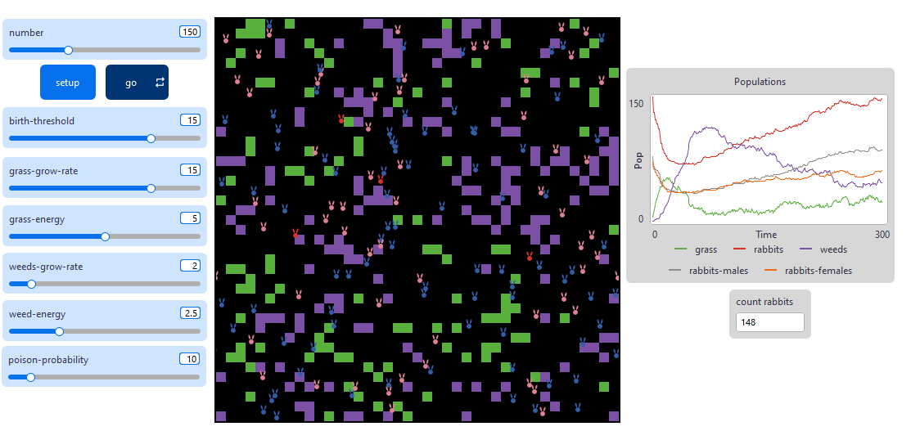
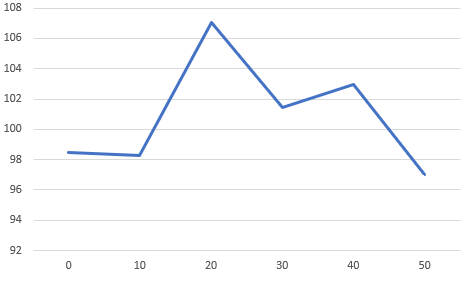

## Комп'ютерні системи імітаційного моделювання
## СПм-22-4, **Чертанов Ярослав Валерійович**
### Лабораторна робота №**2**. Редагування імітаційних моделей у середовищі NetLogo

 

### Варіант 6, модель у середовищі NetLogo:
[Rabbits Grass Weeds](https://www.netlogoweb.org/launch#http://www.netlogoweb.org/assets/modelslib/Sample%20Models/Biology/Rabbits%20Grass%20Weeds.nlogo)

 

### Внесені зміни у вихідну логіку моделі, за варіантом:

**Додавання можливості отруїтися бур'яном**, вірогідність чого зазначена у внутрішніх параметрах.  
Для створення можливості зайців хворіти 3 такти треба о параметрів агентів додати таймер хвороби та показник, чи хворіє зайєць.
<pre>
rabbits-own [ 
  energy 
  sick     
  sick-time 
]
</pre>
у процедурі eat-weeds додана перевірка на початок хвороби зайця та зміна кольору для наочної презентації:
<pre>
to eat-weeds  
  if pcolor = violet[ 
    set pcolor black
    set energy energy + weed-energy
    if not sick and (random-float 100 < poison-probability) [
      set sick true
      set sick-time 3  
      set color red    
    ]
  ]
end
</pre>
Для протікання хвороби створена процедура update-sickness, яка оновлюється перед виконанням зайцем дії у кожному такті.
<pre>
to update-sickness  
  if sick [
    set sick-time sick-time - 1
    if sick-time <= 0 [
      set sick false
      set color white
    ]]
end
</pre>
**Поділ зайців на статі** треба додати окремий параметр gender та додати визначення статі під час створення агенту.
<pre>
rabbits-own [ 
  energy 
  sick     
  sick-time 
  gender 
]

create-rabbits number [
    setxy random-xcor random-ycor
    set energy random 10  
    set sick false
    set sick-time 0
    set gender one-of ["male" "female"]
    update-appearance
]
</pre>
Для зміни кольору кроли замість
<pre>
set color white
</pre>
Буде викликатися процедура update-appearance, включаючи зміни кольору при хвороб.
<pre>
to update-appearance  
  ifelse gender = "male" [
    if not sick [ set color blue ]
  ] [
    if not sick [ set color pink ]
  ]
  if sick [ set color red ]
end
</pre>
Для зміни умови розмноження кроликів змінимо процедуру reproduce, вказавши умові для статі, близкість агенту протилежної статі та 50% ймовірність на розмноження при виконання попередніх умов.
<pre>
to reproduce  
  if energy > birth-threshold and not sick and gender = "female" [
    let potential-mates rabbits with [
      not sick and 
      energy > birth-threshold and 
      gender != [gender] of myself and 
      distance myself <= 1
    ]
    if any? potential-mates and random-float 100 < 50 [
      set energy energy / 2  
      hatch 1 [ 
        fd 1 
        set sick false
        set sick-time 0
        set gender one-of ["male" "female"]
        set energy random 10
        update-appearance
      ]]]
end
</pre>

 

### Внесені зміни у вихідну логіку моделі, на власний розсуд:

**Витиснення трави бур'янами** потребує додавання параметру для патчів, який вказує на стан витиснення:
<pre>
patches-own [
  conversion-time ]
</pre>
Для витиснення трави створена процедура weed-conversion, в якій змінюєтсья стан витиснення при виконанні умов знаходження бур'яну біля трави.
<pre>
to weed-conversion
  ask patches [
    if pcolor = green [
      if any? neighbors with [pcolor = violet] [
        if conversion-time = 1 [
          set pcolor violet
          set conversion-time 0
        ]
        if conversion-time = 0 [
          set conversion-time 1
        ]
      ]
      if not any? neighbors with [pcolor = violet] [
        set conversion-time 0
      ]
    ]
    if pcolor != green [
      set conversion-time 0
    ]
  ]
end
</pre>
при витисненні трави бур'янами вона також перетворюється на бур'ян.

Фінальний код моделі та її інтерфейс доступні за [посиланням](RGW_changed.nlogox).
 

## Обчислювальні експерименти

### 1. Вплив вірогідності хвороби від бур'яну на середню популяцію зайців
Досліджується залежність середньої кількості агентів-зайців протягом певної кількості тактів (500), від вірогідності хвороби при поїданні бур'яну, зазначеній на початку симуляції.
Експерименти проводяться при вірогідності 0-50, з кроком 10, усього 6 симуляцій.  
Інші керуючі параметри мають значення:
- **number**: 150
- **birth-threshold**: 15
- **grass-grow-rate**: 15
- **grass-energy**: 5
- **weeds-grow-rate**: 2
- **weed-energy**: 2.0

<table>
<thead>
<tr><th>Можливість захворіти</th><th>Середня кількість зайців</th></tr>
</thead>
<tbody>
<tr><td>0</td><td>98.48</td></tr>
<tr><td>10</td><td>98.28</td></tr>
<tr><td>20</td><td>107.03</td></tr>
<tr><td>30</td><td>101.42</td></tr>
<tr><td>40</td><td>102.94</td></tr>
<tr><td>50</td><td>97.03</td></tr>
</tbody>
</table>

Графік наочно показує, що можливість захворіти не впливає на популяцію зайців, через особливості реалізації функції хворіння.