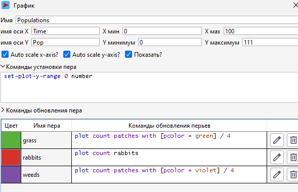
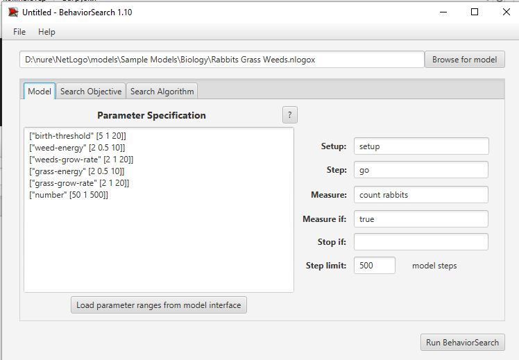
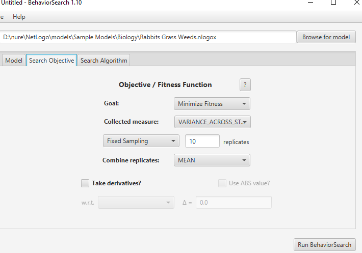
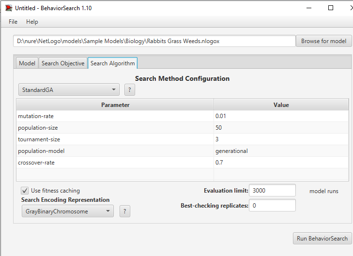
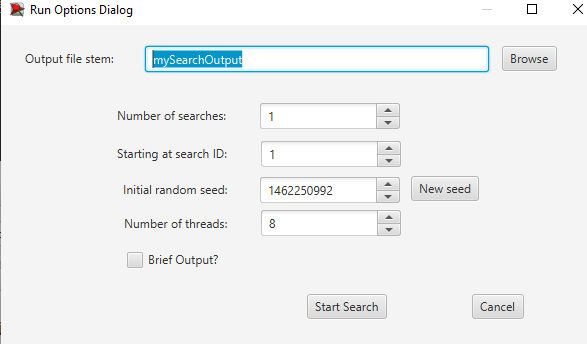
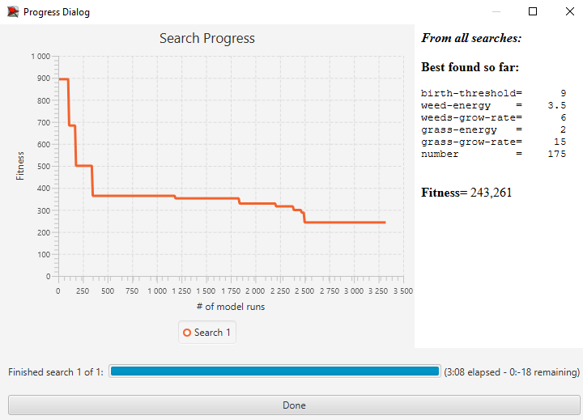
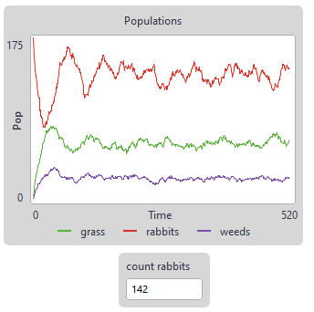
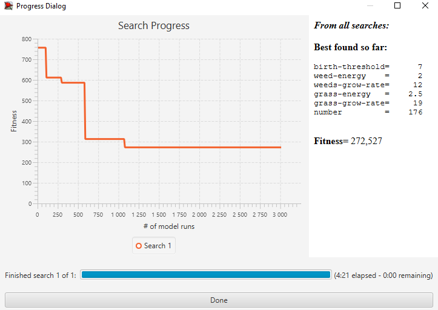
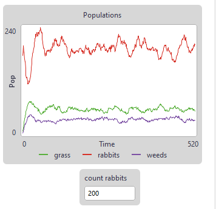

## Комп'ютерні системи імітаційного моделювання
## СПм-22-11, **Чертанов Ярослав Валерійович**
### Лабораторна робота №**3**. Використання засобів обчислювального интелекту для оптимізації імітаційних моделей

 

### Варіант 6, модель у середовищі NetLogo:
[Rabbits Grass Weeds](https://www.netlogoweb.org/launch#http://www.netlogoweb.org/assets/modelslib/Sample%20Models/Biology/Rabbits%20Grass%20Weeds.nlogo)

 

### Налаштування середовища BehaviorSearch:

**Обрана модель**:
<pre>
D:\nure\NetLogo\models\Sample Models\Biology\Rabbits Grass Weeds.nlogox
</pre>
**Параметри моделі** (вкладка Model):  
*Параметри та їх модливі діапазони були **автоматично** вилучені середовищем BehaviorSearch із вибраної імітаційної моделі, для цього є кнопка «Завантажити діапазони параметрів із інтерфейсу моделі»*:
<pre>
["birth-threshold" [5 1 20]]
["weed-energy" [2 0.5 10]]
["weeds-grow-rate" [2 1 20]]
["grass-energy" [2 0.5 10]]
["grass-grow-rate" [2 1 20]]
["number" 50 1 500] 
</pre>
Мінімальні початкові параметри змінені з 0, тому що іначе популяція може вмерти дуже швидко.
Використовувана **міра**:  
Для фітнес-функції було обрано **середній відхил популяції**, для чого потрібно отримати поточну кількість кроликів у певний момент часу і вираз для його розрахунку взято з налаштувань графіка аналізованої імітаційної моделі в середовищі NetLogo  
  
та вказано у параметрі "**Measure**":
<pre>
count rabbits
</pre>
Відхил популяції кроликів повиннен враховуватися **в середньому** за весь період симуляції тривалістю 500 тактів, починаючи з 0 такту симуляції.  
Параметр зупинки за умовою ("**Stop if**") у разі не використовувався.  
Загальний вигляд вкладки налаштувань параметрів моделі:  

**Налаштування цільової функції** (вкладка Search Objective):  
Метою підбору параметрів імітаційної моделі, що описує симуляцію лугу, є **мінімізація** значення відхилення кількості кроликів від середнього значення – це вказано через параметр "**Goal**" зі значенням **Minimize Fitness**. Для отримання саме середньої різниці кроликів у поточний момент між середньою кількістю кроликів під час усієї симуляції у параметрі "**Collected measure**" вказано **VARIANCE_ACROSS_STEPS**.  
Щоб уникнути викривлення результатів через випадкові значення, що використовуються в логіці самої імітаційної моделі, **кожна симуляція повторюється по 10 разів**, результуюче значення розраховується як **середнє арифметичне**.
Загальний вигляд вкладки налаштувань цільової функції:  

**Налаштування алгоритму пошуку** (вкладка Search Algorithm):  
*На цьому етапі було визначено модель, налаштовано її параметри (тобто вказано, які з них незмінні, а які в процесі пошуку можуть змінюватися і в яких діапазонах), і обрано міру, що лежить в основі функції пристосованості, що дозволяє оцінити якість кожного перевіряємого BehaviorSearch варіантів рішення.  
У ході дослідження на лабораторній роботі використовуються два алгоритми: Випадковий пошук(**RandomSearch**) і Простий генетичний алгоритм (**StandardGA**).  
Для цих алгоритмів, що вирішують завдання пошуку такого набору параметрів імітаційної моделі, щоб мінімізувати значення середнього відхилення кількості кроликів, необхідно вказати "**Evaluation limit**", та "**Search Space Encoding Representation**". Загальноприйнятого "кращого" способу кодування немає, тому використовується значення GrayBinaryChromosome.
Загальний вид вкладки налаштувань алгоритму пошуку:  

 

### Результати використання BehaviorSearch:
Діалогове вікно запуску пошуку *(можна залишити за замовчуванням, але стежте, куди пишеться результат)*:  

Результат пошуку параметрів імітаційної моделі, використовуючи **генетичний алгоритм**:  

Графік середньої кількості кроликів за потрібних 500 тактів виглядає так:

 
При обрахунку середнього відхилення за отриманних з графіку значень у таблиці Excel отримаємо значення 18.08742518.

Результат пошуку параметрів імітаційної моделі, використовуючи **випадковий пошук**:  

Графік середньої кількості кроликів за потрібних 500 тактів виглядає так:

При обрахунку середнього відхилення за отриманних з графіку значень у таблиці Excel отримаємо значення 17.42268563.